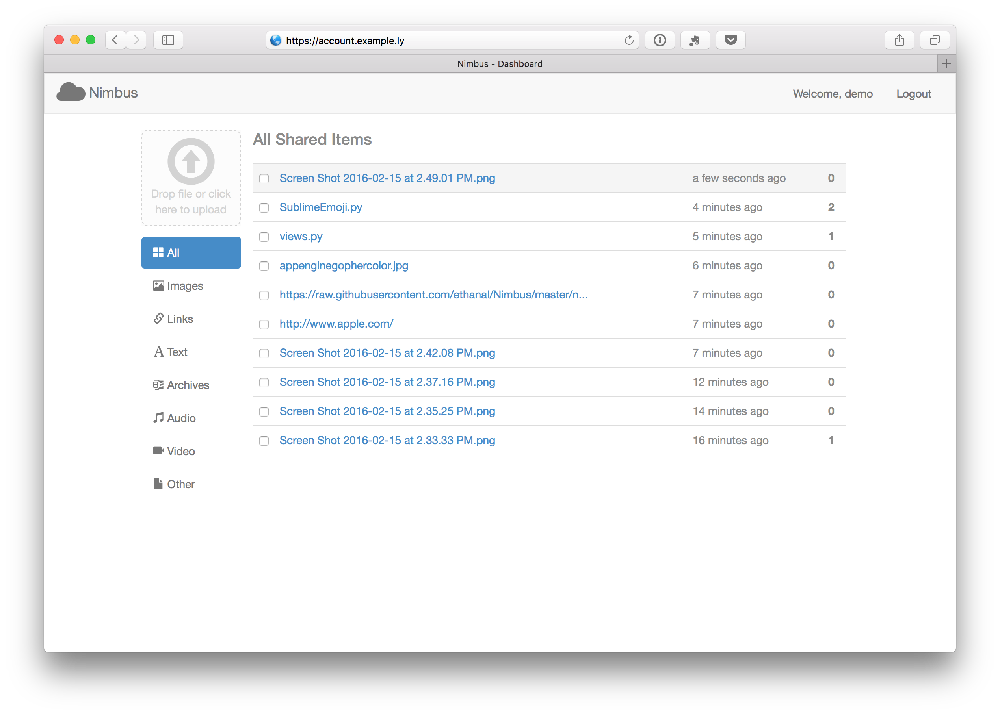
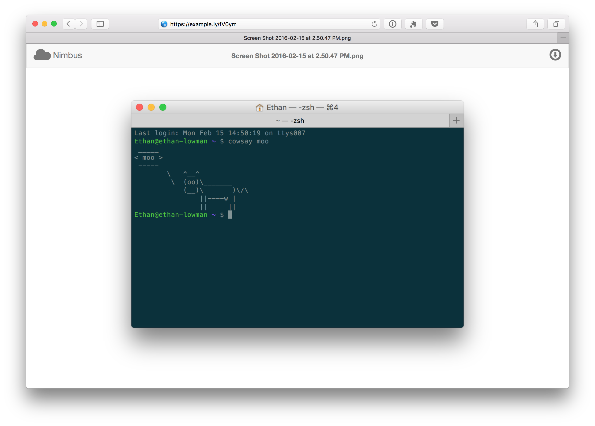
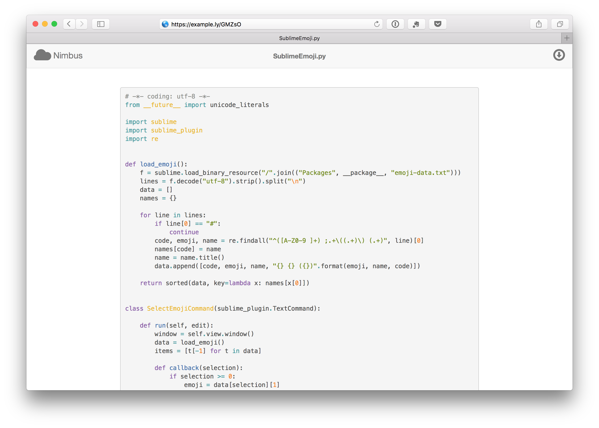
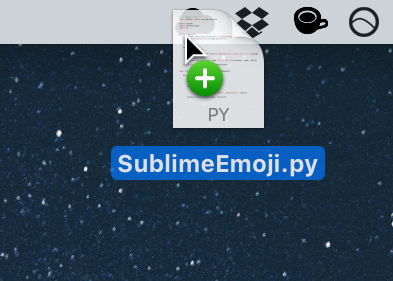

<h1 align="center">
  
  <br>
  Nimbus
</h1>

Nimbus is a private file sharer and URL shortener. Heavily inspired by [Cloudapp](http://www.getcloudapp.com/), Nimbus is a free and open source solution to file sharing and URL shortening that you can host yourself and fully control.

Nimbus consists of several components:

* A website that displays sharing pages for generated links and redirects shortened URLs to their targets
* A website to manage shared items
* An API to manipulate shared items
* A Mac OS X menubar app to upload files and shorten links

The menubar app is only compatible with OS X 10.9 and up since it is written in [Swift](https://developer.apple.com/swift/). The files are stored in Amazon S3, so you must have an AWS account.

##Screenshots
<table>
  <tr>
    <td></td>
    <td></td>
  </tr>
  <tr>
    <td></td>
    <td></td>
  </tr>
</table>

##Features

- Share pages that show file previews or redirect to the shortened link
  - Image file previews
  - Text file previews with automatic syntax highlighting if applicable
- Screenshots are automatically uploaded and the share link is copied to the clipboard
- Drag a file or text to the menubar icon to upload it and copy the share link to the clipboard
- Drag a URL to the menubar icon to create a shortened link and copy it to the clipboard
- Keep track of view counts for files and shortened URLS

##Setup

To set up the Django app, perform the following steps on your server (assumes [pip](http://pip.readthedocs.org/en/latest/), [virtualenv](http://virtualenv.readthedocs.org/en/latest/), and [MySQL](http://www.mysql.com/) are already installed)

1. Create a virtualenv and activate it
2. Clone the repository (from here on, it is assumed that the respository's location is `/usr/local/www/Nimbus`)
3. While in the repository root, install the Python requirements by running

   ```bash
   pip install -r requirements/production.txt
   ```

4. Create a database and grant a user full access to it.
5. Follow the instructions in `nimbus/settings/secret.sample.py` to create a secrets file with your MySQL and Amazon S3 credentials
6. Set up the environment for the Django app by running

   ```bash
   export PRODUCTION=TRUE
   ```

7. Set up the database and create your user by running `./manage.py syncdb`
8. Start a Django shell (`./manage.py shell`) and run the following commands, replacing `example.com` with your domain name

   ```python
   from django.contrib.sites.models import Site
   Site.objects.update(name="example.com", domain="example.com")
   ```

9. Collect static files by running

   ```bash
   yes yes | ./manage.py collectstatic
   ```

###Serving Nimbus

Make sure you have a domain name configured with the following records:

```
@       IN A  <IP address of your server>
api     CNAME @
account CNAME @
files   CNAME files.<your domain name>.s3.amazonaws.com.
```

Also make sure you have an Amazon S3 bucket called `files.<your domain name>`

The recommended setup for serving Nimbus is [Gunicorn](http://gunicorn.org/) managed by [Supervisor](http://supervisord.org/) with [nginx](http://nginx.org/) as a reverse proxy. Configuration requirements are as follows.

* Nginx must be listening on the subdomains `account` and `api` of your domain as well as the root domain. Forward all of this traffic to Gunicorn - the Django app handles the subdomain routing.
* The attribute `client_max_body_size` must be set in the nginx config to a sufficiently large value to allow uploads of big files.
* Static file requests (`/static/`) should be aliased to `nimbus/collected_static` in the repository root
* Supervisor must call the version of gunicorn in your virtualenv

####Example Supervisor Configuration

```ini
[program:nimbus]
directory = /usr/local/www/Nimbus
user = nobody
command = /usr/local/virtualenvs/Nimbus/bin/gunicorn nimbus.wsgi:application --user=nobody --workers=1 --bind=127.0.0.1:8080
environment = PRODUCTION=TRUE
stdout_logfile = /var/log/sites/nimbus.gunicorn.log
stderr_logfile = /var/log/sites/nimbus.gunicorn.log
autostart = true
autorestart = true
```

####Example Nginx Configuration
```nginx
server {
    listen 80;
    server_name example.com account.example.com api.example.com;
    return 301 https://$host$request_uri;
}

server {
    listen 443 ssl;
    server_name example.com account.example.com api.example.com;

    ssl on;
    ssl_certificate /usr/local/certs/example.com.crt;
    ssl_certificate_key /usr/local/certs/example.com.key;

    client_max_body_size 1024M;

    access_log /var/log/sites/nimbus.access.log;
    error_log /var/log/sites/nimbus.error.log;

    location /favicon.ico {
        alias /usr/local/www/Nimbus/nimbus/static/img/favicon.ico;
    }

    location /static/ {
        alias /usr/local/www/Nimbus/nimbus/collected_static/;
    }

    location / {
        rewrite ^/((?!(api-auth|admin))(.*))/$ /$1 permanent;
        proxy_pass http://127.0.0.1:8080;
        proxy_set_header X-Forwarded-Host $host;
        proxy_set_header Host $host;
        proxy_set_header X-Real-IP $remote_addr;
        proxy_set_header X-Forwarded-Proto $scheme;
    }
}
```

##API Reference
API documentation can be found [here](api_docs.md).

## Contact
Ethan Lowman
- https://github.com/ethanal
- ethan@ethanlowman.com
